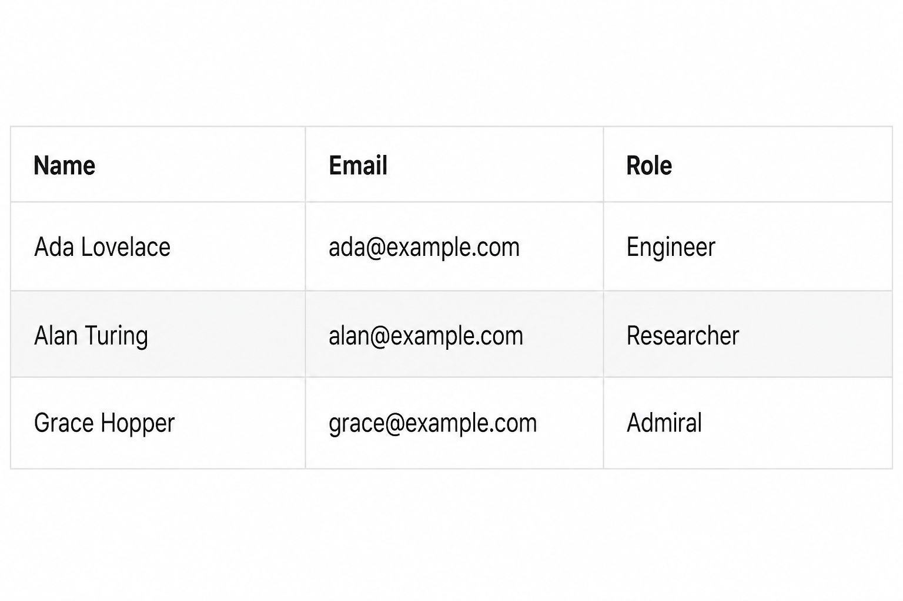

# didi-simple-table

A small, typed table component for Angular 14+.

Pass in columns and row data. The table renders headers, cells, empty and loading states, custom cell and header templates, nested fields, optional column sorting, search, pagination, row click, selection, and a sticky header. A horizontal scroll container appears when the content is wider than its parent.



## Install

```bash
npm install didi-simple-table
```

Peer dependencies: `@angular/core` and `@angular/common` `>=14.0.0 <23.0.0` (Angular 14 through 22).

Supported Angular versions: **14, 15, 16, 17, 18, 19, 20, 21, 22**.

## Usage

Import `SIMPLE_TABLE_IMPORTS` on the standalone component that uses the table. That array includes the table and the `didiCell` / `didiHeader` / `didiEmpty` / `didiLoading` template directives. Define a row type, then bind `columns` and `data`. `key` is checked against the row type, so typos fail at compile time. Nested fields use dotted paths such as `address.city`.

```ts
import { Component } from '@angular/core';
import { SIMPLE_TABLE_IMPORTS, TableColumn } from 'didi-simple-table';

interface User {
  name: string;
  email: string;
  role: string;
}

@Component({
  selector: 'app-users',
  standalone: true,
  imports: [...SIMPLE_TABLE_IMPORTS],
  template: `
    <didi-simple-table
      [columns]="columns"
      [data]="users"
      [loading]="loading"
      [sortable]="true"
      [pageSize]="3"
    >
      <ng-template didiCell="email" let-row>
        <a [href]="'mailto:' + row.email">{{ row.email }}</a>
      </ng-template>

      <ng-template didiCell="role" let-row>
        <span class="badge">{{ row.role }}</span>
      </ng-template>

      <ng-template didiEmpty>No users to show.</ng-template>
      <ng-template didiLoading>Loading users…</ng-template>
    </didi-simple-table>
  `
})
export class UsersComponent {
  loading = false;

  columns: TableColumn<User>[] = [
    { key: 'name', label: 'Name' },
    { key: 'email', label: 'Email' },
    { key: 'role', label: 'Role' }
  ];

  users: User[] = [
    { name: 'Ada Lovelace', email: 'ada@example.com', role: 'Engineer' },
    { name: 'Alan Turing', email: 'alan@example.com', role: 'Researcher' },
    { name: 'Grace Hopper', email: 'grace@example.com', role: 'Admiral' }
  ];
}
```

NgModule apps can import `SimpleTableModule` instead. It re-exports the same standalone component and directives.

```ts
import { NgModule } from '@angular/core';
import { SimpleTableModule } from 'didi-simple-table';

import { UsersComponent } from './users.component';

@NgModule({
  declarations: [UsersComponent],
  imports: [SimpleTableModule]
})
export class UsersModule {}
```

Columns without a `didiCell` template still print the field value. Use `format` on a column for a simple formatter, `didiHeader` for a custom header, and `didiCell` for buttons, icons, or conditional styles. If `loading` is true, the loading state replaces the rows. If `loading` is false and `data` is empty, the empty state is shown instead. With `[sortable]="true"`, click a header to cycle ascending, descending, and the original order. Strings, numbers, and dates sort automatically; set `sortType` or `compare` when you need control. `[multiSort]="true"` sorts by more than one column. Server paging leaves `data` as-is and emits `(sortChange)` so the parent can reload.

Set `[pageSize]` to paginate. Switch with `[pagination]="'client'"` or `[pagination]="'server'"`. `[pageSizeOptions]` adds a rows-per-page selector. `[searchable]` adds a search box; client mode filters locally, server mode emits the term so you can query the API.

- **Client:** pass the full list. The table searches, sorts, and slices it.
- **Server:** pass one page, `[total]` from the API, and reload `data` on `(queryChange)` (or the individual page, sort, search, and page-size events).
- **Page state:** sort and search reset to page 1 by default. Set `[resetPageOnSort]` / `[resetPageOnSearch]` to `false` to keep the current page (it is clamped if it is now past the last page).

`(rowClick)` emits the row you clicked. `[selectable]="'single'"` or `"'multiple'"` highlights rows; bind `[(selected)]` to keep them. Use `identityKey` so selection still matches after the API returns new objects.

`[stickyHeader]="true"` with `maxHeight` keeps headers visible while rows scroll. Sticky headers and a sticky first column use an opaque background so rows do not show through. `caption` names the table for assistive tech.

`[columnCollapse]="true"` lets users hide extra columns. Set `hidden: true` on a column to start it collapsed, or `collapsible: false` to keep it always visible.

On small screens, `responsive="stack"` turns each row into a labeled card when the table is narrower than `breakpoint`. Card labels use the same `didiHeader` template as the column title (so translations apply), or `column.label` if there is no template. `maxHeight` / sticky header are ignored while stacked so the pager stays under the cards. `responsive="scroll"` keeps the grid and scrolls sideways; `[stickyFirstColumn]="true"` pins the first column. Set `hideOnMobile: true` on a column to drop it automatically in the narrow view.

By default the table **inherits** the host app’s font and text color (`theme="inherit"`). Set `theme="light"` (or `dark`, `teal`, `warm`, `compact`) for a packaged look. You can still override CSS variables on `didi-simple-table`, or add a class and target inner elements (`th`, `td`, `.didi-pager`).

```html
<didi-simple-table [columns]="columns" [data]="users"></didi-simple-table>
```

```html
<didi-simple-table theme="dark" [columns]="columns" [data]="users"></didi-simple-table>
```

```css
didi-simple-table {
  --didi-accent: #0f766e;
  --didi-header-bg: #f0fdfa;
  --didi-radius: 4px;
}

.my-table th {
  text-transform: uppercase;
}
```

```html
<didi-simple-table
  [columns]="columns"
  [data]="users"
  [loading]="loading"
  [sortable]="true"
  [sort]="sort"
  [pageSize]="10"
  [pageSizeOptions]="[10, 25, 50]"
  [page]="page"
  [pagination]="pagination"
  [total]="total"
  [searchable]="true"
  [search]="search"
  (queryChange)="onQueryChange($event)"
></didi-simple-table>
```

## API

### Import

| Export | Use |
| --- | --- |
| `SIMPLE_TABLE_IMPORTS` | Spread into a standalone component `imports` array. Includes the table and template directives. |
| `SimpleTableModule` | Import in an `NgModule` (or in `imports` of a standalone component). Re-exports the same pieces. |
| `SimpleTableComponent` | Standalone table. Import this plus the template directives, or use the array / module above. |

### Selector

`didi-simple-table`

### Inputs

| Input            | Type               | Default        | Description                                      |
| ---------------- | ------------------ | -------------- | ------------------------------------------------ |
| `columns`        | `TableColumn<T>[]` | `[]`           | Header labels and which field each column reads. |
| `data`           | `T[]`              | `[]`           | Rows to render. Full list for client paging, or one page for server paging. |
| `loading`        | `boolean`          | `false`        | When true, shows an overlay if rows are already visible, or a loading row when the table is empty. |
| `emptyMessage`   | `string`           | `'No data'`    | Empty text when there is no search/filter and no custom `didiEmpty` content. Override via `labels` too. |
| `noResultsMessage` | `string`         | `'No matching rows'` | Empty text when search or column filters match nothing. |
| `loadingMessage` | `string`           | `'Loading...'` | Loading text when there is no custom `didiLoading` content. |
| `sortable`       | `boolean`          | `false`        | When true, clickable headers sort by that column. |
| `sort`           | `TableSort<T> \| TableSort<T>[] \| null` | `null` | Current sort. A single spec, or an array when `multiSort` is on. Use with `(sortChange)` or `[(sort)]`. |
| `multiSort`      | `boolean`          | `false`        | When true, each header click adds or cycles that column without clearing the others. |
| `pageSize`       | `number \| null`   | `null`         | Rows per page. Omit or `null` to show every row. |
| `pageSizeOptions` | `number[] \| null` | `null`        | Sizes shown in the pager select. Omit to hide the control. |
| `page`           | `number`           | `1`            | Current page (1-based). Use with `(pageChange)` or `[(page)]`. |
| `pagination`     | `'client' \| 'server'` | `'client'` | `client` searches, sorts, and slices `data`. `server` leaves `data` as-is. |
| `total`          | `number \| null`   | `null`         | Total row count. Required for the pager in `server` mode. |
| `searchable`     | `boolean`          | `false`        | When true, shows a search box above the table. |
| `search`         | `string`           | `''`           | Current search text. Use with `(searchChange)` or `[(search)]`. |
| `searchPlaceholder` | `string`        | `'Search'`     | Placeholder for the search box. |
| `searchKeys`     | `Array<TableField<T>> \| null` | `null` | Fields to match. Defaults to every column `key`. |
| `searchDebounce` | `number`           | `300`          | Delay in ms before search emits. `0` is immediate. Enter and clear apply immediately. |
| `labels`         | `Partial<TableLabels>` | `{}`        | Override pager, search, columns, and aria strings. Use `{count}`, `{label}`, `{page}`, `{total}`, `{start}`, `{end}` placeholders. |
| `filters`        | `TableFilters<T>`  | `{}`           | Per-column filter values. Use with `(filtersChange)` and `column.filter`. |
| `resetPageOnSort` | `boolean`         | `true`         | When true, sorting moves back to page 1. |
| `resetPageOnSearch` | `boolean`       | `true`         | When true, searching moves back to page 1. |
| `selectable`     | `false \| 'single' \| 'multiple'` | `false` | Row selection. `true` is the same as `'single'`. |
| `selected`       | `T[]`              | `[]`           | Currently selected rows. Use with `(selectedChange)` or `[(selected)]`. |
| `identityKey`    | `TableField<T>`    | —              | Field used to compare rows after they are recreated, including nested paths. |
| `selectOnRowClick` | `boolean`        | `true`         | When false, clicking a row emits `(rowClick)` but does not toggle selection. Use checkboxes to select. |
| `selectAllMode`  | `'page' \| 'filtered'` | `'page'` | Header checkbox selects the current page, or every matching row. |
| `stickyHeader`   | `boolean`          | `false`        | When true, header cells stay visible while the table body scrolls. |
| `maxHeight`      | `string \| null`   | `null`         | Max height of the scroll area, for example `'240px'`. Use with `stickyHeader`. |
| `caption`        | `string`           | `''`           | Accessible table name (visually hidden). |
| `theme`          | `'inherit' \| 'light' \| 'dark' \| 'teal' \| 'warm' \| 'compact'` | `'inherit'` | `inherit` uses the host font and `currentColor`. Packaged looks: `light`, `dark`, `teal`, `warm`, `compact`. Unknown values fall back to `inherit`. |
| `columnCollapse` | `boolean`          | `false`        | When true, users can hide and restore columns from a Columns menu and header controls. |
| `hiddenColumns`  | `Array<TableField<T>> \| null` | `null` | Keys of collapsed columns. Use with `(hiddenColumnsChange)` or `[(hiddenColumns)]`. |
| `responsive`     | `'scroll' \| 'stack'` | `'scroll'` | `scroll` keeps the grid and overflows horizontally. `stack` becomes labeled cards when the table is narrower than `breakpoint`. |
| `breakpoint`     | `string`           | `'640px'`      | Width at which `stack` and `hideOnMobile` apply. Measured on the table, not the viewport. |
| `stickyFirstColumn` | `boolean`       | `false`        | When true, the first column stays visible while the table scrolls horizontally. |
| `striped`        | `boolean`          | `false`        | Alternate row backgrounds. |
| `density`        | `'comfortable' \| 'compact' \| null` | `null` | Compact padding without changing the color theme. |
| `nullPlaceholder`| `string`           | `''`           | Shown when a cell value is null or empty. |
| `locale`         | `string`           | —              | Used by `formatType` (`number`, `date`, `currency`). |
| `rowClass`       | `(row) => string \| string[] \| Record<string, boolean>` | — | Extra classes on each data row. |
| `cellClass`      | `(value, row, column) => ...` | — | Extra classes on each cell. |
| `expandable`     | `boolean`          | `false`        | Row expand control. Pair with `ng-template didiDetail`. |
| `groupBy`        | `TableField<T> \| null` | `null`    | Group client rows by a field. |
| `exportable`     | `boolean`          | `false`        | Shows an Export CSV button. |
| `columnResize`   | `boolean`          | `false`        | Drag header edges to resize. |
| `columnReorder`  | `boolean`          | `false`        | Drag headers to reorder. |
| `virtualScroll`  | `boolean`          | `false`        | Window rows inside `maxHeight`. |
| `persistKey`     | `string \| null`   | `null`         | Saves hidden columns, order, and widths to `localStorage`. |

### Outputs

| Output        | Type                            | Description                                      |
| ------------- | ------------------------------- | ------------------------------------------------ |
| `sortChange`  | `TableSort<T> \| TableSort<T>[] \| null` | Emits on header click. `null` means unsorted. Array when `multiSort` is on. |
| `pageChange`  | `number`                        | Emits when the page changes.                     |
| `pageSizeChange` | `number`                     | Emits when the rows-per-page value changes.      |
| `searchChange` | `string`                        | Emits when the search box value changes.         |
| `queryChange` | `TableQuery<T>`                 | Emits `{ page, pageSize, sort, search, filters }` after page, size, sort, search, or filter changes. |
| `rowClick`    | `T`                             | Emits the row when the row is clicked.           |
| `selectedChange` | `T[]`                        | Emits the selected rows.                         |
| `hiddenColumnsChange` | `Array<TableField<T>>` | Emits the keys of collapsed columns.        |
| `filtersChange` | `TableFilters<T>`             | Emits per-column filter values.                  |
| `cellEdit`    | `TableCellEdit<T>`              | Emits after an editable cell is committed.       |
| `expandedChange` | `T[]`                        | Emits expanded rows.                             |
| `columnOrderChange` | `Array<TableField<T>>`   | Emits after a header drag-reorder.               |

### Templates

| Template                 | Context                         | Description |
| ------------------------ | ------------------------------- | ----------- |
| `ng-template didiCell="key"` | `let-row` (also `row`, `column`, `value`) | Custom cell for the column whose `key` matches. `value` is the resolved field, including nested paths. |
| `ng-template didiHeader="key"` | `let-column` | Custom header for the column whose `key` matches. Also used as the label on stacked cards. |
| `ng-template didiEmpty`  | none                            | Custom empty content. Omit it, or leave it empty, to use `emptyMessage`. |
| `ng-template didiLoading`| none                            | Custom loading content. Omit it, or leave it empty, to use `loadingMessage`. |
| `ng-template didiDetail` | `let-row`                       | Expanded row body when `expandable` is on. |
| `ng-template didiFooter="key"` | `let-column` (also `rows`, `value`) | Footer cell for a column. |

### `TableColumn<T>`

| Field   | Type                | Description                                      |
| ------- | ------------------- | ------------------------------------------------ |
| `key`      | `TableField<T>` | Field on the row, a nested path such as `address.city`, or a virtual key such as `_actions`. |
| `label`    | `string`           | Header text.                                 |
| `sortable` | `boolean`          | Set to `false` to disable sorting for this column when the table is sortable. |
| `width` / `minWidth` | `string` | Column size, for example `'12rem'`. |
| `align`    | `'start' \| 'center' \| 'end'` | Cell alignment. Use `end` for numbers. |
| `pinned`   | `boolean`          | Pin this column while scrolling horizontally. |
| `editable` | `boolean`          | Double-click to edit. Emits `(cellEdit)`. |
| `filter`   | `boolean \| 'text' \| 'select' \| 'number' \| 'date'` | Show a filter control under the header. |
| `filterOptions` | `{ label, value }[]` | Options when `filter` is `'select'`. |
| `format`   | `(value, row) => unknown` | Optional formatter used when there is no `didiCell` template. |
| `formatType` | `'number' \| 'date' \| 'currency'` | Built-in `Intl` formatting when `format` is omitted. |
| `footer`   | `(rows) => unknown` | Footer value from the filtered/sorted rows. |

### `TableColumn<T>`

| Field   | Type                | Description                                      |
| ------- | ------------------- | ------------------------------------------------ |
| `key`      | `TableField<T>` | Field on the row, or a nested path such as `address.city`. Use a dedicated key for template-only columns (for example `actions`). |
| `label`    | `string`           | Header text.                                 |
| `sortable` | `boolean`          | Set to `false` to disable sorting for this column when the table is sortable. |
| `format`   | `(value, row) => unknown` | Optional formatter used when there is no `didiCell` template. |
| `sortType` | `'auto' \| 'string' \| 'number' \| 'date'` | How to compare this column. Default `auto` detects numbers, dates, and strings. |
| `compare`  | `(left, right, leftRow, rightRow) => number` | Custom comparator. Return negative if `left` comes first. |
| `hidden`   | `boolean`          | Set to `true` to start the column collapsed. |
| `collapsible` | `boolean`       | Set to `false` to keep the column always visible when `columnCollapse` is on. |
| `hideOnMobile` | `boolean`      | Set to `true` to hide the column when the table is narrower than `breakpoint`. |

`T` defaults to `Record<string, unknown>` if you do not pass a row type.

### `TableSort<T>`

| Field       | Type               | Description                          |
| ----------- | ------------------ | ------------------------------------ |
| `key`       | `TableField<T>` | Column currently being sorted.       |
| `direction` | `'asc' \| 'desc'`  | Sort direction.                      |

`null` means the table is showing rows in the original `data` order.

### `TableQuery<T>`

| Field      | Type               | Description                                      |
| ---------- | ------------------ | ------------------------------------------------ |
| `page`     | `number`           | Current page (1-based).                          |
| `pageSize` | `number \| null`   | Rows per page, or `null` when paging is off.     |
| `sort`     | `TableSortState<T>` | Current sort, or `null` when unsorted.          |
| `search`   | `string`           | Current search text.                             |
| `filters`  | `TableFilters<T>`  | Per-column filter values.                        |

Listen to `(queryChange)` when the parent loads rows from an API so page, size, sort, and search stay in one handler.

### Theming

`theme` defaults to `inherit`, so drop-in use matches the host app’s font and text color. Pick a packaged look when you want the library palette instead. Then optionally override CSS variables, or add a class and put extra rules in a global stylesheet (`styles.css`).

| Theme | Look |
| --- | --- |
| `inherit` | Default. Uses the page `font-family`, `font-size`, and `currentColor`. Borders and hover tints are mixed from that color. |
| `light` | Packaged white table. |
| `dark` | Dark surface and blue accent. |
| `teal` | Teal headers and selection. |
| `warm` | Orange headers and selection. |
| `compact` | Tighter padding and smaller type. |

```html
<didi-simple-table [columns]="columns" [data]="users"></didi-simple-table>
```

```html
<didi-simple-table theme="dark" [columns]="columns" [data]="users"></didi-simple-table>
```

Set CSS variables on `didi-simple-table` (or a parent) to map your app tokens. Values below are the `light` theme; `inherit` uses `currentColor` and transparent surfaces.

```css
:root {
  --didi-accent: var(--app-primary);
  --didi-text: var(--app-text);
}
```

| Variable | Default | Use |
| --- | --- | --- |
| `--didi-accent` | `#2563eb` | Sort arrow, focus, checkboxes |
| `--didi-text` | `#0f172a` | Body text |
| `--didi-muted` | `#64748b` | Empty state, pager text |
| `--didi-surface` | `#ffffff` | Table background |
| `--didi-border` | `#e5e7eb` | Frame and row lines |
| `--didi-header-bg` | `#f8fafc` | Header and pager background |
| `--didi-header-text` | `#334155` | Header text |
| `--didi-header-size` | `12px` | Header font size |
| `--didi-hover` | `#f1f5f9` | Row hover |
| `--didi-selected` | `#eff6ff` | Selected row |
| `--didi-selected-hover` | `#dbeafe` | Selected row hover |
| `--didi-radius` | `10px` | Corner radius |
| `--didi-row-height` | `44px` | Header row height |
| `--didi-cell-pad-y` | `12px` | Cell padding top/bottom |
| `--didi-cell-pad-x` | `14px` | Cell padding left/right |
| `--didi-pager-bg` | header bg | Pager background |
| `--didi-font-size` | `14px` | Table font size |
| `--didi-focus` | accent | Focus ring |

```css
.my-table td {
  padding: 8px 10px;
}

.my-table .didi-pager {
  justify-content: flex-end;
}
```

## Local development

This repo is an Angular workspace. The publishable library lives in `projects/simple-table`. The demo app in `projects/demo` imports it from source so you can try changes without publishing.

```bash
npm install
npm start
```

Open `http://localhost:4200/`.

```bash
npm run build
```

The library build output is written to `dist/simple-table`.
